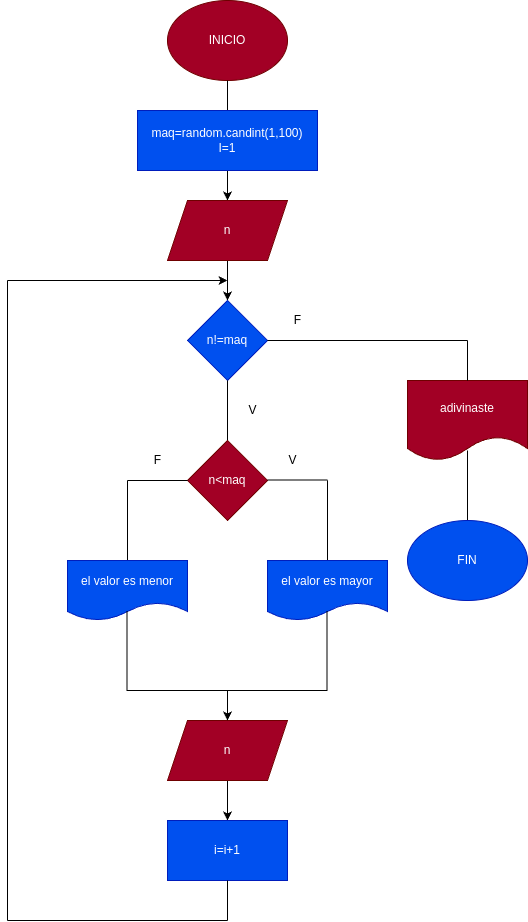

# while_3
tercer ejercisio usando while

# input
usted tendra que adivinar un numero entre el 1 a 100 si escoge un numero menor al numero a adivinar le dira que es mayor y si escribe un numero mayor le dira que es menor

## Diseño 
